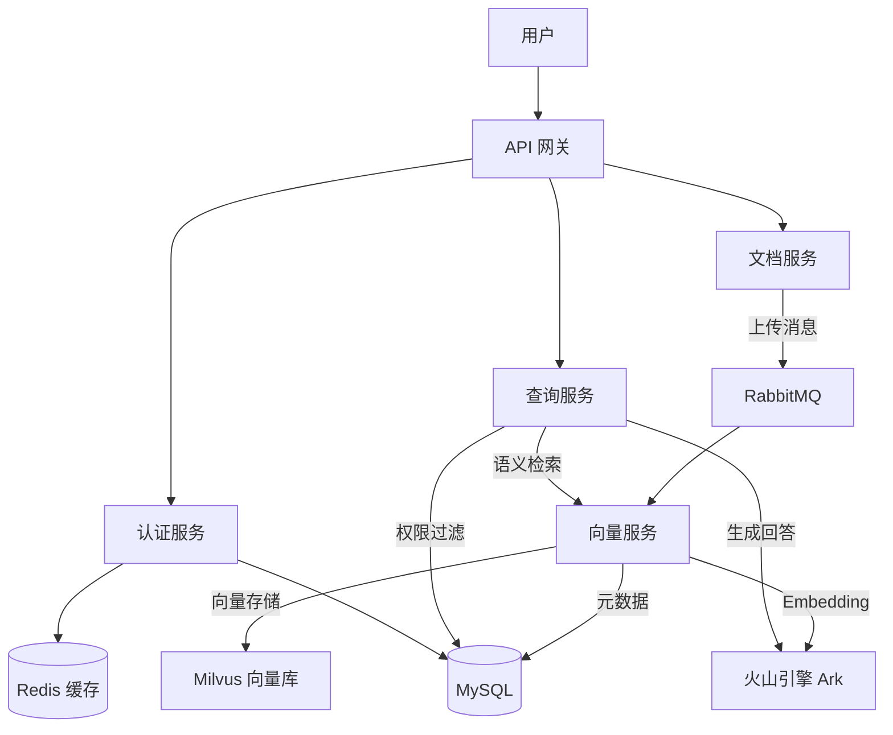

# Enterprise Knowledge Base (EKB)


## 1. 项目概述

**Enterprise Knowledge Base (EKB)** 是一个基于微服务架构的企业级知识库系统，旨在为企业提供高效、安全的文档管理与智能问答能力。通过集成大语言模型（LLM）与向量检索技术（RAG），实现对海量非结构化文档的深度理解与精准检索。

### 核心功能

*   **智能问答 (RAG)**: 基于检索增强生成技术，提供准确的文档问答能力，支持上下文对话。
*   **权限控制 (RBAC)**: 细粒度的角色与部门级访问控制，确保“财务部文档仅财务可见”。
*   **高效向量化**: 异步处理文档上传与向量化，支持长文本语义切分与 Embedding 生成。
*   **微服务架构**: 认证、文档、向量、查询、网关五大服务独立部署，高内聚低耦合。
*   **全链路监控**: 集成 Prometheus、Grafana 与 Jaeger，实现指标监控与分布式链路追踪。

### 系统架构



### 技术栈

*   **后端语言**: Go 1.24+ (Gin, GORM)
*   **向量数据库**: Milvus
*   **大模型/Embedding**: Volcengine Ark (豆包模型)
*   **消息队列**: RabbitMQ
*   **数据库**: MySQL 8.0
*   **缓存**: Redis
*   **监控**: Prometheus, Grafana, Jaeger, OpenTelemetry
*   **部署**: Docker Compose, Kubernetes (Minikube)

---

## 2. 快速开始指南

### 前置要求

*   Go 1.24+
*   Docker & Docker Compose
*   Minikube (可选，用于 K8s 部署)
*   MySQL, Redis, Milvus (可通过 Docker 启动)

### 安装步骤

1.  **克隆仓库**
    ```bash
    git clone https://github.com/chongs12/enterprise-knowledge-base.git
    cd enterprise-knowledge-base
    ```

2.  **配置环境变量**
    复制 `.env.example` 为 `.env` 并填入必要的 API Key：
    ```bash
    cp .env.example .env
    ```
    *   `ARK_API_KEY`: 火山引擎 API Key
    *   `DB_PASSWORD`: 数据库密码
    *   `MILVUS_ADDR`: Milvus 地址 (默认 `localhost:19530`)

3.  **启动基础设施**
    使用 Docker Compose 启动 MySQL, Redis, Milvus, RabbitMQ 等基础服务：
    ```bash
    docker-compose up -d mysql redis milvus rabbitmq jaeger
    ```

4.  **运行服务**
    *   **方式 A: Docker Compose (推荐)**
        ```bash
        docker-compose up -d --build
        ```
    *   **方式 B: Kubernetes (Minikube)**
        请参考 [Kubernetes 操作指南](docs/k8s-operation-guide.md)。

5.  **验证安装**
    访问 Grafana 面板查看系统状态：`http://localhost:3000` (默认账号 admin/admin)

---

## 3. 开发指南

### 目录结构

```
enterprise-knowledge-base/
├── cmd/                # 各微服务入口 (auth, document, vector, query, gateway)
├── internal/           # 核心业务逻辑
│   ├── auth/           # 认证模块
│   ├── document/       # 文档管理模块
│   ├── vector/         # 向量化与检索模块
│   ├── rag_query/      # RAG 问答模块
│   └── common/         # 公共模型与工具
├── pkg/                # 通用库 (database, logger, middleware)
├── k8s/                # Kubernetes 部署配置
├── docs/               # 项目文档
└── docker-compose.yml  # 本地编排文件
```

### 代码规范

*   遵循 Go 官方 Code Review Comments。
*   使用 `gofmt` 格式化代码。
*   所有服务需集成 OpenTelemetry Tracing。
*   关键业务逻辑需编写单元测试。

### 测试方法

```bash
# 运行所有单元测试
go test ./...

# 运行特定模块测试
go test ./internal/vector/...
```

---

## 4. 贡献指南

我们欢迎任何形式的贡献！

### 问题反馈
如果您发现了 Bug 或有新功能建议，请通过 GitHub Issues 提交，并包含复现步骤和环境信息。

### PR 提交规范
1.  Fork 本仓库并创建特性分支 (`git checkout -b feature/AmazingFeature`).
2.  提交代码 (`git commit -m 'Add some AmazingFeature'`).
3.  推送到分支 (`git push origin feature/AmazingFeature`).
4.  提交 Pull Request。

### 版本管理
本项目遵循 [Semantic Versioning](https://semver.org/) 版本管理策略。

---

## 许可证

本项目采用 Apache 2.0 许可证 - 详见 [LICENSE](LICENSE) 文件。
